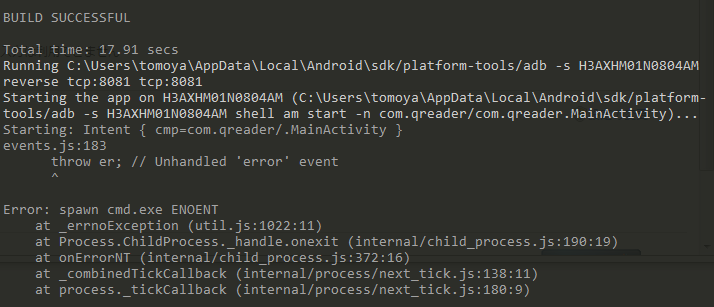

## 経緯

日頃SurfacePro2でReactNativeを触っていたがデスクトップにも環境を入れるかと思った際に



```
Error: spawn cmd.exe ENOENT
```

で30分ぐらいハマる


## 解決策

[events.js:182 throw er; // Unhandled 'error' event Error: spawn cmd ENOENT](https://github.com/remy/nodemon/issues/1118)

c:\windows\system32を環境変数のPathに入れれば解決した。